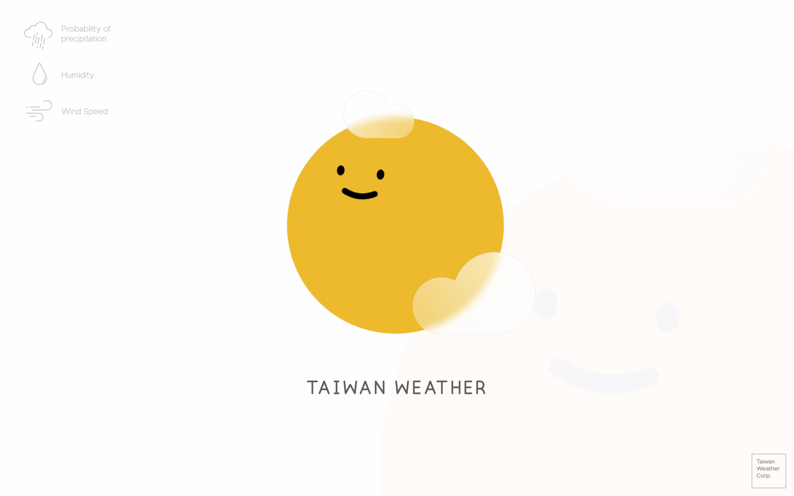

# Taiwan Weather

## Introduction

Taiwan Weather is a web application that allows you to check the current weather and following five day forecast for choosen area in Taiwan.

## Usage

Simply select your desired location in setting menu and apply.

## Stacks

-   [React](https://github.com/facebook/react) with Create React App
-   [React Router](https://github.com/ReactTraining/react-router)
-   [Framer Motion](https://github.com/framer/motion)
-   [Lottie React](https://github.com/Gamote/lottie-react)

## Credit

Logo and icon were generated by [Boring-avatars](https://github.com/boringdesigners/boring-avatars).

### License

[MIT](./license)
